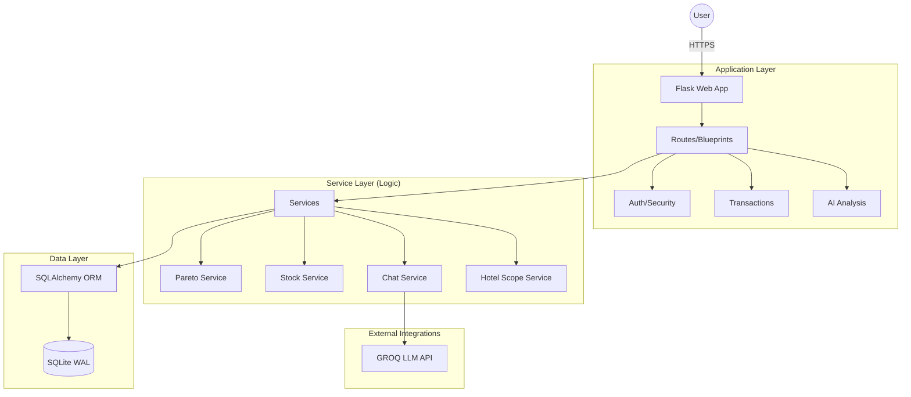
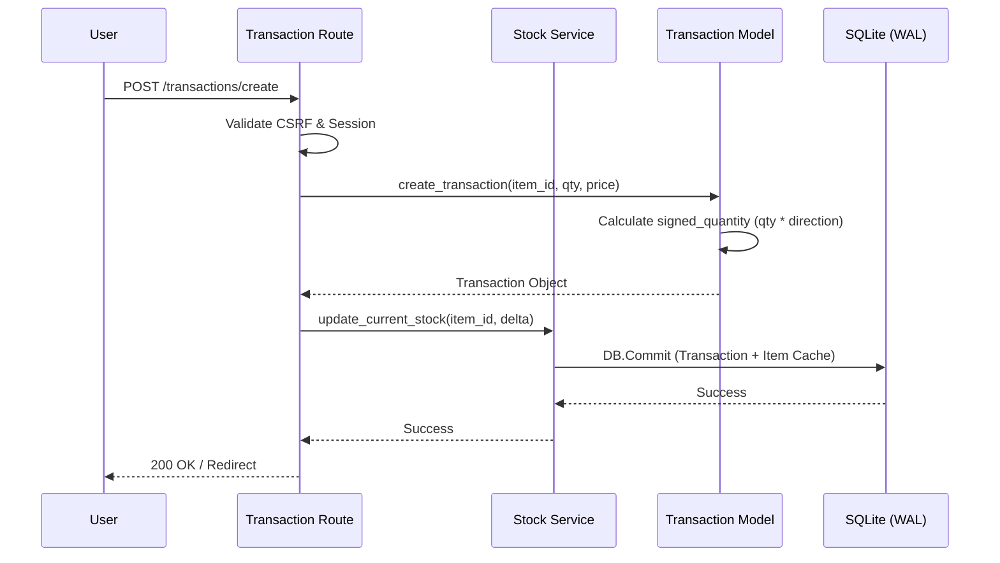

# 02-architecture.md

## High-Level Architecture
The Pareto system follows a layered monolithic architecture with a clear separation of concerns, optimized for deployment in containerized environments.

### Component Diagram

### Sequence Diagram: Transaction Creation (Critical Workflow)

## Dependency List
### Core Internal Modules
*   `services/hotel_scope_service.py`: Centralized permission enforcement.
*   `models/transaction.py`: Core logic for stock integrity.
*   `services/chat_service.py`: Orchestrates AI context retrieval.

### Major External Libraries
*   **Flask (3.0.0)**: Web framework.
*   **SQLAlchemy (2.0.23)**: ORM for persistence.
*   **Pandas (2.1.4)**: Data processing for Pareto/ABC.
*   **OpenAI (GROQ)**: AI analysis capabilities.
*   **Jdatetime (4.1.1)**: Jalali calendar support.

## Architectural Risks
| Risk | Severity | Description |
| :--- | :--- | :--- |
| **SQLite Concurrency** | Medium | While WAL mode helps, heavy concurrent write loads from multiple hotels could hit lock contention. |
| **AI API Latency** | Low | GROQ API outages or latency would degrade the chatbot and analysis features. |
| **Soft Delete Exposure** | Medium | Many queries rely on `filter(is_deleted != True)`. If a developer forgets this in a new report, deleted data could leak. |
| **Unit Normalization** | Medium | Conversion factors rely on hardcoded mappings in `item.py`. Incorrect factors lead to invalid stock levels. |
