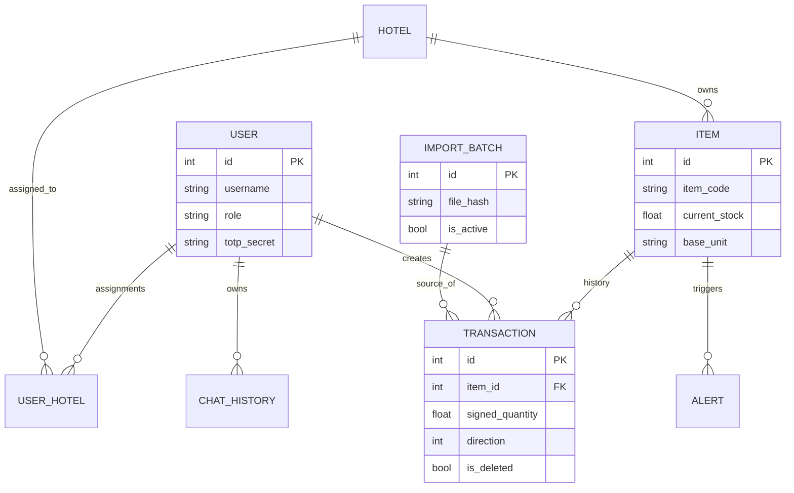

# 04-data-model-and-storage.md

## Storage Architecture
The system uses **SQLite** as its primary storage engine. 
*   **Why SQLite?**: Low overhead, easy backups (single file), and excellent performance for read-heavy inventory workloads.
*   **Concurrency**: Optimized using **WAL (Write-Ahead Logging)** mode via pragmas in `app.py` and `config.py`.

## Entity Relationship Diagram

## Data Lifecycle
1.  **Ingestion**: Data enters via Excel import (Admin) or manual entry (Staff).
2.  **Processing**: The `DataImporter` cleans strings, converts Persian digits, and maps sheet names to Hotels.
3.  **Persistence**: Every operation creates a `Transaction` record. The `Item.current_stock` is a cached sum.
4.  **Consistency**: 
    - **Soft Deletes**: Transactions are rarely physically deleted (`is_deleted` flag).
    - **Rebuilds**: The `stock_service` can iterate over all transactions to fix cached `current_stock` mismatches.
5.  **Retention**: Audit logs and transactions are retained indefinitely for legal and financial auditing.

## Consistency Model
*   **ACID**: Provided by SQLite.
*   **Stock Integrity**: Enforced at the application layer. Every stock update MUST be paired with a transaction record. The `init_db.py` and `migrate_new_changes.py` scripts show a strong focus on backfilling consistency for unit normalization.
*   **Idempotency**: Import batches use `file_hash` to prevent accidental double-processing of the same Excel file.
